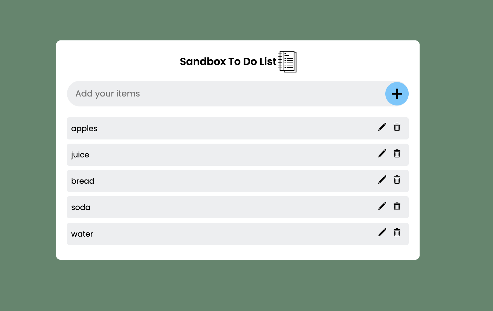

# Sandbox To-Do List

Lightweight browser to-do app built with vanilla HTML, CSS, and JavaScript. Tasks live entirely in `localStorage`, so the list stays intact after refreshes without needing a backend.

## Layout
- Rounded white card centered on a blue background.
- Header row displays the app title alongside a notebook icon.
- Input bar spans the card with a rounded grey background and a circular plus button on the right.
- Todo items render in a stacked list; each row shows the item text with edit (pencil) and delete (trash) icons aligned to the right.

## Functionality
- **Add items** by typing in the input and clicking the plus icon.
- **Edit items** with the pencil icon; the plus button swaps to a refresh icon while editing.
- **Mark complete** via a double-click on the item text; the row gains a check badge and strike-through.
- **Delete items** with the trash icon (confirmation prompt included).
- **Persistent storage** keeps the list in the browser via `localStorage`.

## Getting Started
Open `index.html` in any modern browser—no build steps required. All assets (scripts, styles, icons) are bundled in the `sandboxtodolist` directory.

